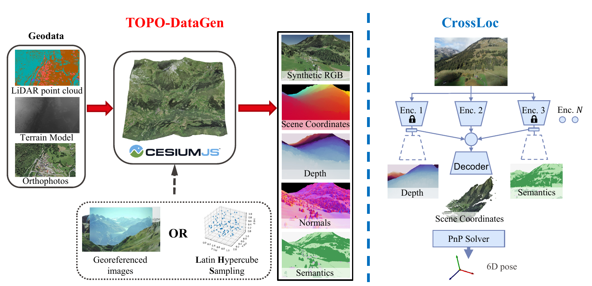
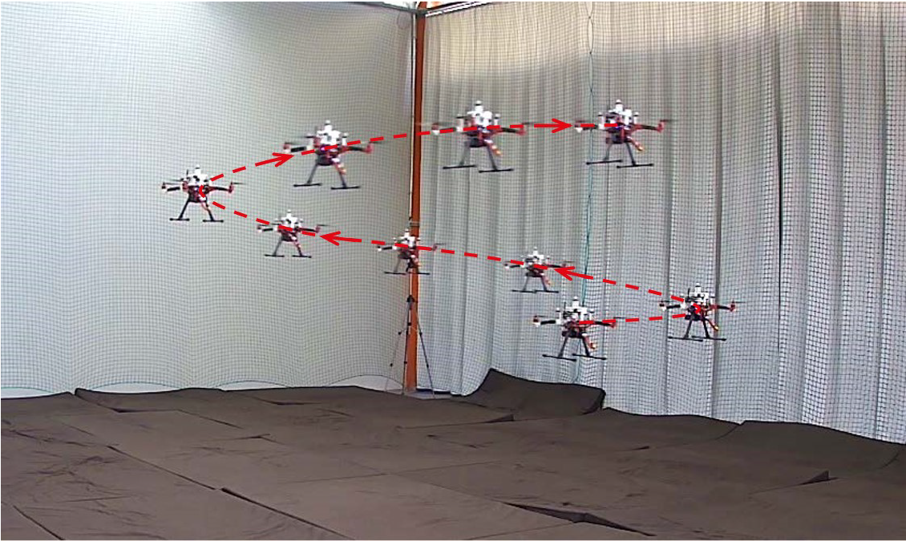

Welcome to my personal website!

I am currently a second-year master's student in [Robotics](https://www.epfl.ch/education/master/programs/robotics/) at [EPFL](https://www.epfl.ch/en/), Switzerland. Starting from Sept 2022, I will begin my master thesis with the topic "Semantic SLAM with Quality-adaptive Properties", under the supervision of [Dr. Dániel Béla Baráth](https://people.inf.ethz.ch/dbarath/), [Dr. IRO ARMENI](https://ir0.github.io/) and [Prof. Marc Pollefeys](https://people.inf.ethz.ch/pomarc/) at [CVG](http://www.cvg.ethz.ch/index.php) in ETH. 

During my study at EPFL, I worked with [Izzet Kagan Erunsal](https://www.epfl.ch/labs/disal/people/team/kaganerunsal/) and [Prof. Alcherio Martinoli](https://www.epfl.ch/labs/disal/people/team/alcheriomartinoli/) on [Multiple Micro Aerial Vehicles formation control](/sp1) at [DISAL](https://www.epfl.ch/labs/disal/). In addition, I took part in the project on visual navigation algorithm at [TOPO](https://www.epfl.ch/labs/topo/) lab, supervised by [Dr. Iordan Doytchinov](https://people.epfl.ch/iordan.doytchinov) and [Prof. Bertrand Merminod](https://people.epfl.ch/bertrand.merminod?lang=en).

I received my Bachelor's Degree in Mechanical Engineering in 2020 from [Shanghai Jiao Tong University (SJTU)](https://en.sjtu.edu.cn/), Shanghai, China. In that period, I worked on Cross-Modal Fusion or Biomolecular Structure Determination with [Prof. Gregory Chirikjian](https://me.jhu.edu/faculty/gregory-s-chirikjian/) at [NUS](https://www.nus.edu.sg/) and UR robot control with [Prof. Zhuang Fu](https://me.sjtu.edu.cn/en/FullTimeTeacher/fuzhuang.html) at SJTU.

My current research interests are Aerial Robotics, SLAM and 3d reconstruction. For more info, please refer to the latest [CV](../files/cv.pdf).

# Publications

	 

**CrossLoc: Scalable Aerial Localization Assisted by Multimodal Synthetic Data**
 
Qi Yan, **Jianhao Zheng**, Simon Reding, Shanci Li, Iordan Doytchinov
 
*CVPR 2022.*
 
[[arXiv](https://arxiv.org/abs/2112.09081)] [[code](https://github.com/TOPO-EPFL/CrossLoc)] [[video](https://www.youtube.com/watch?v=pytRRXPFqFE)] [[website](https://crossloc.github.io/)]

 

	 

**Linear and Nonlinear Model Predictive Control Strategies for Trajectory Tracking Micro Aerial Vehicles: A Comparative Study**
 
Izzet Kagan Erunsal, **Jianhao Zheng**, Rodrigo VENTURA, Alcherio Martinoli
 
*IROS 2022.*
 
[[paper](https://infoscience.epfl.ch/record/298847/files/IROS_22_submitted.pdf)] [[video](https://youtu.be/KQShZWSvC0s)]

 