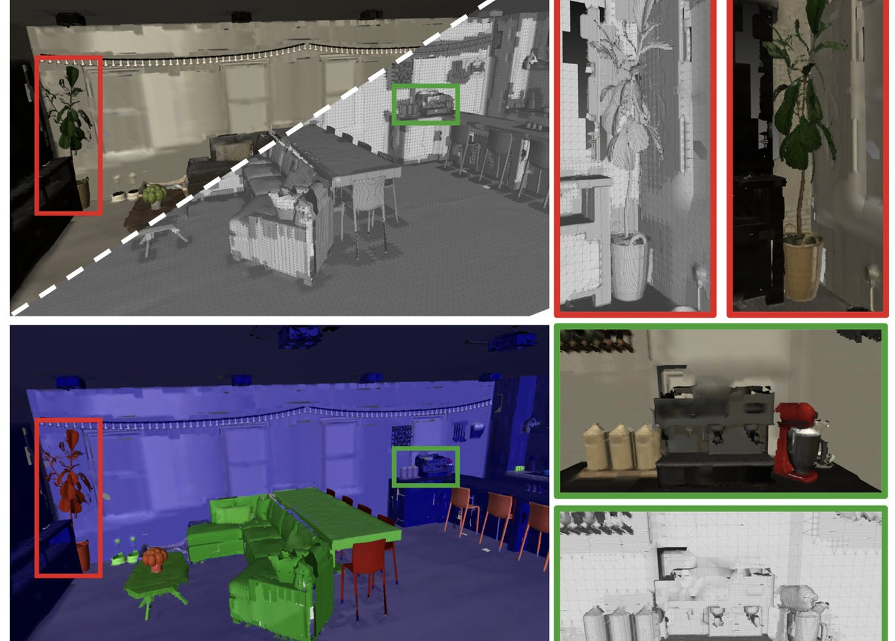

Welcome to my personal website!

I am a second-year PhD student in [Gradient Spaces Lab](https://gradientspaces.stanford.edu/) at Stanford, supervised by [Prof. Iro Armeni](https://ir0.github.io/). I obtained my Master Degree at [EPFL](https://www.epfl.ch/en/), Switzerland, where I worked with [Prof. Alcherio Martinoli](https://www.epfl.ch/labs/disal/people/team/alcheriomartinoli/), [Dr. Iordan Doytchinov](https://people.epfl.ch/iordan.doytchinov) and [Prof. Bertrand Merminod](https://people.epfl.ch/bertrand.merminod?lang=en). I received my Bachelor's Degree at [Shanghai Jiao Tong University (SJTU)](https://en.sjtu.edu.cn/). I am broadly interested in 3D vision and Robotics in dynamic environment.

# Publications

    

        
    

    

        <h3>MAP-ADAPT: Real-Time Quality-Adaptive Semantic 3D Maps</h3>
        
<strong>Jianhao Zheng</strong>, Daniel Barath, Marc Pollefeys, Iro Armeni

        
<em>ECCV 2024.</em>

        

            <a href="https://arxiv.org/pdf/2406.05849">[arXiv]</a>
            <!-- <a href="https://github.com/TOPO-EPFL/CrossLoc">[code]</a> -->
            <a href="https://www.youtube.com/watch?v=MB2D2j-rJ8E&ab_channel=JianhaoZheng">[video]</a>
            <a href="https://map-adapt.github.io/">[website]</a>
        

    

 

    

        
    

    

        <h3>CrossLoc: Scalable Aerial Localization Assisted by Multimodal Synthetic Data</h3>
        
Qi Yan, <strong>Jianhao Zheng</strong>, Simon Reding, Shanci Li, Iordan Doytchinov

        
<em>CVPR 2022.</em>

        

            <a href="https://arxiv.org/abs/2112.09081">[arXiv]</a>
            <a href="https://github.com/TOPO-EPFL/CrossLoc">[code]</a>
            <a href="https://www.youtube.com/watch?v=pytRRXPFqFE">[video]</a>
            <a href="https://crossloc.github.io/">[website]</a>
        

    

 

    

        
    

    

        <h3>Linear and Nonlinear Model Predictive Control Strategies for Trajectory Tracking Micro Aerial Vehicles: A Comparative Study</h3>
        
Izzet Kagan Erunsal, <strong>Jianhao Zheng</strong>, Rodrigo VENTURA, Alcherio Martinoli

        
<em>IROS 2022.</em>

        

            <a href="https://infoscience.epfl.ch/record/298847/files/IROS_22_submitted.pdf">[paper]</a>
            <a href="https://youtu.be/KQShZWSvC0s">[video]</a>
        

    

 

# Experience
- Teaching Assistant: Multivariable control and coordination systems (EE-477 Fall 2021) @ EPFL.
- Teaching Assistant: Designing for Gradient Spaces (CEE-342 Spring 2024) @ Stanford.

# Misc
- Workshop Organisation: [Long-Term Perception](https://mit-spark.github.io/Longterm-Perception-WS/)@IROS 2024

- Reviewer: CVPR, ECCV, NeurIPS, IROS

 