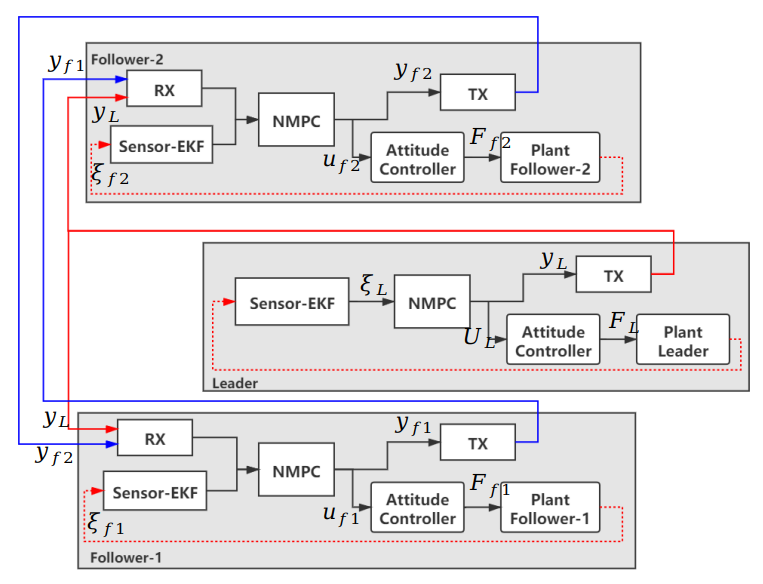
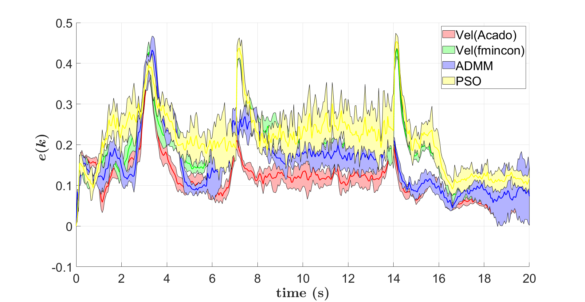
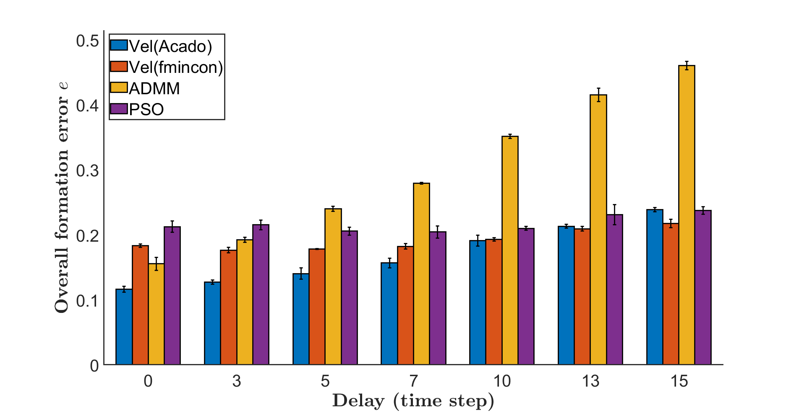
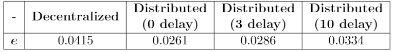

<!--  -->
<!--  -->

**Semster Research student** at [Distributed Intelligent Systems and Algorithms Laboratory](https://www.epfl.ch/labs/disal/), EPFL since *Feb. 2021*

Supervisor: [Izzet Kagan Erunsal](https://www.epfl.ch/labs/disal/people/team/kaganerunsal/) (PhD student) and [Prof. Alcherio Martinoli](https://www.epfl.ch/labs/disal/people/team/alcheriomartinoli/)

 
## Introduction
The main goal of this project is to compare the effectiveness of different Distributed MPC architectures and a [Decentralized MPC scheme](https://ieeexplore.ieee.org/document/8901098) in a leader-follower formation control problem. Several communication flaws such as delay, packet dropout and jitter are implemented in the simulation to test the robustness of the controller. The three Distributed MPC structures for multi-robot formation control are following:

- **Velocity sharing based**

  Distribute the overall formation control into several sub-MPC problem and each agent obtain the coupled information, i.e. velocity, of its neighbors from communication.

- **ADMM-based**

  Rewrite the centralized problem by introducing several slack variables and distribute it by Alternating Direction Method of Multipliers (ADMM).

- **PSO-based**

  Separate the overall control problem into several sub-task, each agent communicates the global best particle to its neighbors and utilize Particle Swarm Optimization (PSO) to solve its subtask based on the particle received from neighbors.

For more details, please refer to the [report](/files/DistrMPC_project.pdf).

 

## System architecture

     

 

## Experiments
### MATLAB Simulation

The simulation experiments on the three types of Distributed MPC have been carried out in MATLAB 2020b with an Intel i7-8550U processor. The **ACADO** toolkit with code generation is selected as the solver for the **Velocity sharing based**. The nonlinear programming in **ADMM-based** is solved by **fmincon** in MATLAB. In order to fairly compare the performance, **Velocity sharing based** is also implemented by **fmincon**. Finally, **PSO-based** used **particleswarm** in MATLAB as the solver.

     

An experiment controlled by Velocity sharing based Distributed MPC in MATLAB

<table><tr><td></td><td></td></tr></table>

Formation error evolution with 0 delay and Overall average formation error with different delay

According to the MATLAB simulation, the **PSO-based** has the worst performance on formation maintenance.  The **ADMM-based** has better performance on formation control than the **Velocity sharing based**.  However, it is very sensitive to the communication quality and requires more computational time.  Moreover, the **Velocity  sharing based**  using  ACADO  code  generate  has  far  better  performance than the **ADMM-based** even with perfect communication.  Considering both architecture performance and solver ability, I chose the **Velocity sharing based** to simulate in the Webots-ROS framework.  But, the **ADMM-based** is also promising if it can be implemented in an efficient solver.

 

### Webots-ROS Simulation
In Webots-ROS simulation, the Webots version is R2020b and ROS melodic 1.14.11 has been used. In this simulator, **Velocity sharing based** is compared with a [Decentralized MPC controller](https://ieeexplore.ieee.org/document/8901098). 

     

An experiment controlled by Velocity sharing based Distributed MPC in Webots-ROS

     

Table of overall average formation error

The simulation results indicated that Velocity sharing based Distributed MPC controller has 37% less formation error than the Decentralized MPC controller. Even with high communication delay, Velocity sharing based Distributed MPC still performs better than the Decentralized one.

For more interesting plots and metrics, please refer to the [report](/files/DistrMPC_project.pdf).

 

## Final presentation

<iframe src="https://drive.google.com/file/d/1XjO8MHpXqxkwYaE_ZIoHvBzjoR4DeWhh/preview" width="700" height="400"></iframe>